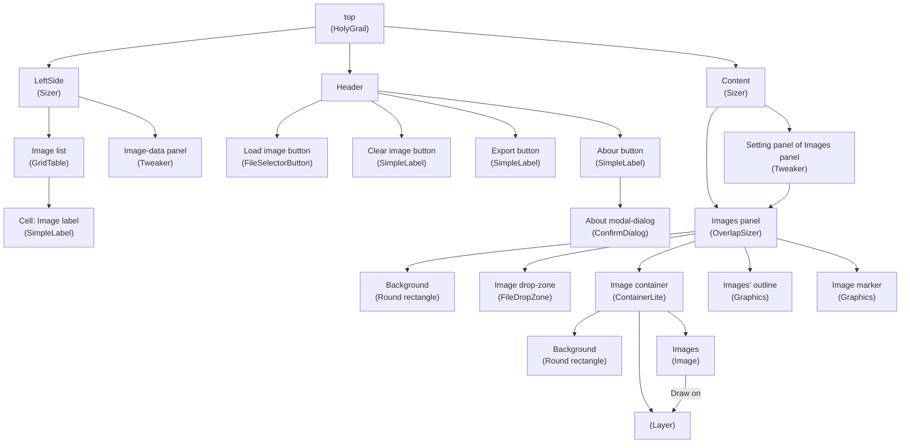

[Diagram of objects' structure](https://mermaid.live/view#pako:eNqdVNtu2zAM_RVBL-uA5geCocDa9DIgRYclT533wFiMK0SWDFlel17-fTRl2U7SBMOeTB6fcyRKFF9l7hTKqSw8VE9iOctsZpeu-pnJ4KovK39xdufM9taDNp8z-av7LSaTCzHHdVhohcRNIQsW-gV9JCec-d9KKHCu60ACjoWhhCW3XqslrAxGWc8c6WCFhoRXaMxUdPIW65YsKxM5xxaeQYDvYNmEgYkiRFQtxB7LZ4RN2vhQ5R2CQp_Z-I2FO1BscaMN1pdNCM62h0Cw0LyzFWNs23IWaDAPzkdqXGHkd2UQPBsOZowduh0UOrK5_lM5H3qHmP6r-OvKNYO2zfxJ6Yg_6O-dAjPTYFzRmQRRtthEMchWV86utS8jLZ32cN70O6Bte6SL9nuqg4ebrXeutR5d6cNv9AaqkXgk2De4hHxTeNdYRVZDwkY_2kh4ukSwxU6X7nvNvKsencW-xxUBkxdC-m5IlBMubY2gLfreJk9IOsOYzXU45VM_NMHoYTf1J-Ei0j07evQ6r0843IPfjLZRcvqBuJP3G_uglv874F3HOWzbx3hsrbovlF05HBfHzLeZh2fh7Ft0I8kZB6mQIw22wBC0LVKzdWnsNuHW4qD7dgbKEaP9ReS5LNGXoBXN5NfMCkGD-AlLzOSUQkXHn8nMvhOvqWiA4bXSNFjkNPgGzyU0wS22Nk955NBTo_FeJpB2-OgcpWswNb7_BbZ1G7A)

Source of diagram

