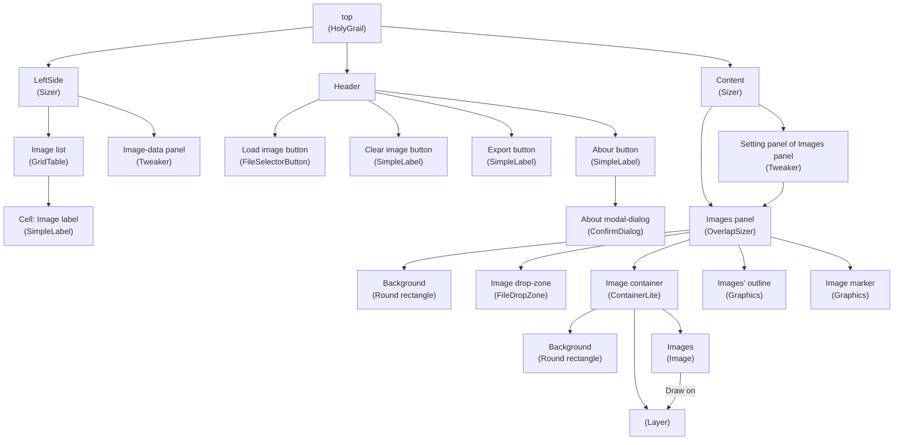

Diagram of objects' structure

```mermaid
graph TD

Top["top<br>(HolyGrail)"]

Top --> LeftSide["LeftSide<br>(Sizer)"]
LeftSide --> ImageList["Image list<br>(GridTable)"]
ImageList --> ImageLabel["Cell: Image label<br>(SimpleLabel)"]
LeftSide --> ImageDataPanel["Image-data panel<br>(Tweaker)"]

Top --> Header
Header --> LoadImageFilesButton["Load image button<br>(FileSelectorButton)"]
Header --> ClearImagesButton["Clear image button<br>(SimpleLabel)"]
Header --> ExportButton["Export button<br>(SimpleLabel)"]
Header --> AboutButton["Abour button<br>(SimpleLabel)"]
AboutButton --> AboutModalDialog["About modal-dialog<br>(ConfirmDialog)"]


Top --> Content["Content<br>(Sizer)"]
Content --> ImagesPanel["Images panel<br>(OverlapSizer)"]
ImagesPanel --> ImagesPanelBackground["Background<br>(Round rectangle)"]
ImagesPanel --> ImageDropZone["Image drop-zone<br>(FileDropZone)"]
ImagesPanel --> ImageContainer["Image container<br>(ContainerLite)"]
ImagesPanel --> ImagesOutline["Images' outline<br>(Graphics)"]
ImagesPanel --> ImageMarker["Image marker<br>(Graphics)"]

ImageContainer --> ImageContainerBackground["Background<br>(Round rectangle)"]
ImageContainer --> Layer
ImageContainer --> Images["Images<br>(Image)"]
Images --> |Draw on| Layer["(Layer)"]

Content --> ImagesPanelSettingPanel["Setting panel of Images panel<br>(Tweaker)"]
ImagesPanelSettingPanel --> ImagesPanel
```