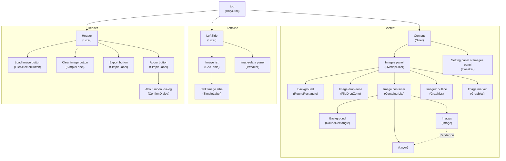

# Atlas-packer

An atlas packer for phaser3 game engine.

## Run project

Double click `preview.bat` file.

## Export project

Double click `build-html.bat` file.

## Diagram of objects' structure

